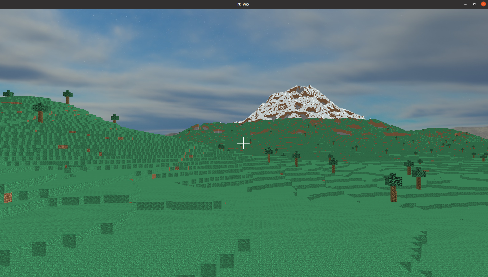
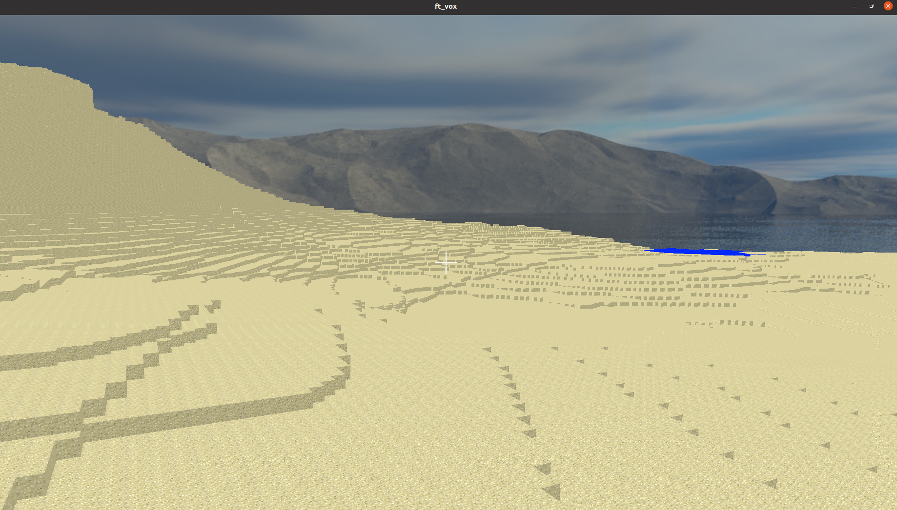
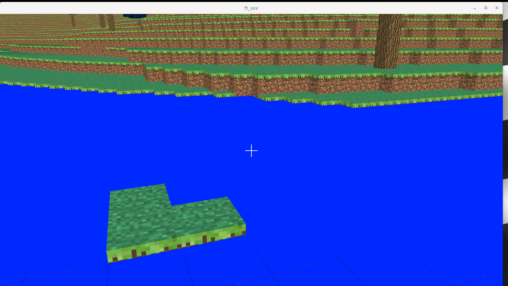
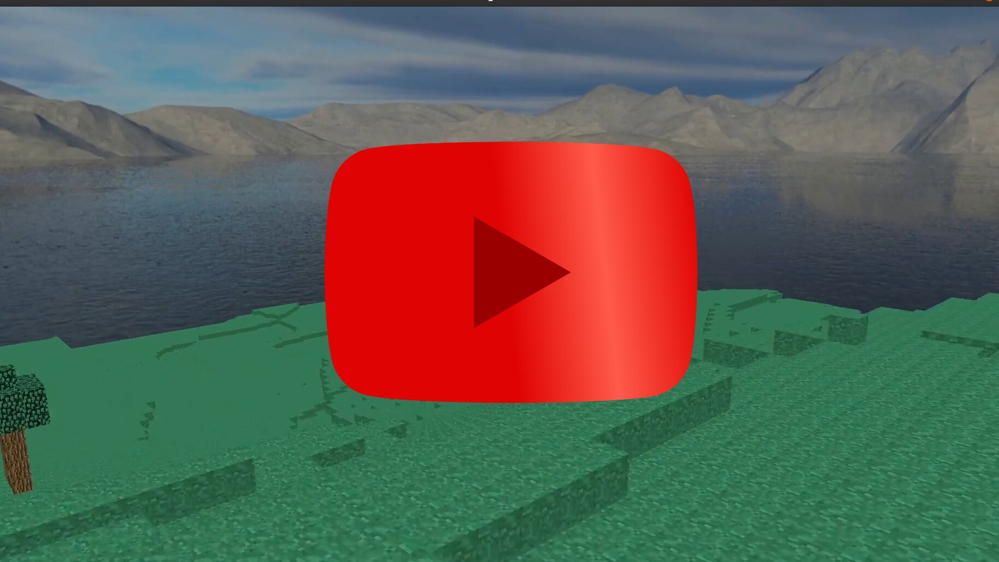

# ft_vox  
C++ OpenGL voxel with advanced procedural generation  

We generate a world using Perlin noise in  Classes/World/ChunkGenerator.  
The player can move their camera, flying in the air indefinitely throughout the world.  
The Perlin noises that define the generation loop around every few thousand blocks, but not at the same pace,  
making it almost an infinite world.  
There is a simple gravity, block collision, and entity management system in place.  

The abstract class Chunk allows us to use different types of child classes, enabling us to manage the data as needed.  
The main child class we utilize is ChunkRLE,  
where we manage the blocks of the chunk as ribbons (rubans).  

We experimented with the geometry shader.  
In the CPU, we generate a buffer containing our face information.  
Each face info includes the position of the block, its type, and the 'size of the face'.  

'Size of the face' refers to grouping multiple faces of the same wall and block type,  
reducing the number of triangles to display.  

Inside the GPU, we create our triangles using the geometry shader. It reduces the amount of RAM used however this does not significantly improve the FPS  

--eestela main dev       ChunkRLE/Shaders/World logic/Generation  
--leocrabe225 main dev   tools/managing data  
--jdamoise main dev      Makefile  

We will implement an easy way to install in the next version  
If you want to try, it runs on linux and we more or less followed learnopengl.com/Getting-started/Creating-a-window  

The window says not responding while loading the world for the first time, it is normal, we will change that later.  
